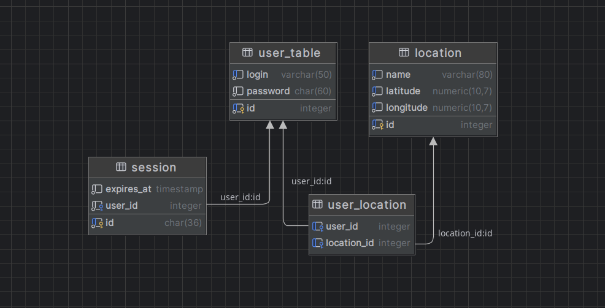

Проект “Погода”
===============================================================================================

Веб-приложение для просмотра текущей погоды. Пользователь может зарегистрироваться и добавить в коллекцию одну или 
несколько локаций (городов, сёл, других пунктов), после чего главная страница приложения начинает отображать список 
локаций с их текущей погодой.

(Пет-проект написанный для освоения, закрепления навыков в Java, Spring)

Оглавление
----------

1. [Использованные инструменты / технологии](#использованные-инструменты--технологии)
2. [Интерфейс приложения](#интерфейс-приложения)
3. [Диаграмма базы данных](#диаграмма-базы-данных)
4. [Требования приложения](#требования-приложения)
5. [Инструкция по запуску приложения](#инструкция-по-запуску-приложения)
6. [Техническое задание](#техническое-задание)

## Использованные инструменты / технологии:

### Backend

 &nbsp;
 &nbsp;
 &nbsp;
 &nbsp;
 &nbsp;
 &nbsp;
 &nbsp;


### Testing

 &nbsp;


### Frontend

 &nbsp;
 &nbsp;
 &nbsp;


### API


## Интерфейс приложения

### Главная страница


URL - '/'
- Можно увидеть все избранные локации с данными о погоде и удалить их. Удаление осуществляется POST-запросом по пути "/remove-location", с передачей location-id.
- Навигационная панель:
    - Отображает логин пользователя
    - Выход: Отправляет GET-запрос на /logout для выхода пользователя. Удаляет куки, содержащее сессию пользователи.
- Поиск: Отправляет GET-запрос на /locations?location-name=query, где query — это введенный пользователем поисковый запрос.

### Страница поиска


URL - '/locations'
- Результат вашего поискового запроса. Вызов Geocoding API для определения долготы и широты.
- Если нажать на "Add", то локация будет сохранена как избранное с POST-запросом на "/locations".

### Страница входа


URL - '/login'
- Страница входа. POST-запрос на "/login" при нажатии на кнопку входа. Создает в базе данных id сессии и отправляет их в куки браузера пользователя.

### Страница регистрации


URL - '/register'
- Страница регистрации. POST-запрос на "/register". Создает в базе данных id сессии и отправляет их в куки браузера пользователя, сохраняет ваш логин и зашифрованный пароль.

### Страницы ошибок


- Возникают, когда что-то пошло не так на сервере.

## Диаграмма базы данных


## Требования приложения

+ Java 21+
+ Apache Maven
+ Tomcat 10+
+ PosgreSQL
+ OpenWeather Api Key

## Инструкция по запуску приложения

### Клонирование репозитория

1. **Клонирование репозитория с помощью Git**:
    - Откройте терминал или командную строку.
    - Выполните команду:
      ```sh
      git clone https://github.com/VladShi/weather-tracker.git
      ```
    - Перейдите в директорию проекта:
      ```sh
      cd weather-tracker
      ```

### Настройка проекта

1. **Настройка конфигурационного файла**:
    - В корне проекта находится файл `application.properties.origin`.
    - Переименуйте этот файл в `application.properties`.
    - Откройте файл `application.properties` и заполните его данными вашей базы данных и API ключом OpenWeatherMap. API ключ можно получить после регистрации по ссылке [https://openweathermap.org/](https://openweathermap.org/).


### Сборка WAR-файла

1. **Сборка с помощью Maven**:
    - Откройте терминал или командную строку.
    - Перейдите в корневую папку вашего проекта, где находится файл `pom.xml`.
    - Запустите команду:
      ```sh
      mvn package
      ```
    - После успешного выполнения команды, WAR-файл будет создан в директории `/target` (например, `/target/weather-tracker-1.0.war`).

### Развертывание WAR-файла

1. **Развертывание в Tomcat**:
    - Откройте графический интерфейс Tomcat (Tomcat Manager).
    - Перейдите в раздел `Deploy`.
    - Выберите `WAR file to deploy`.
    - Нажмите `Choose File` и выберите ваш WAR-файл (например, `weather-tracker-1.0.war`).
    - Нажмите `Deploy`.

### Запуск приложения в IntelliJ IDEA

1. **Запуск приложения в IntelliJ IDEA**:
    - Откройте проект в IntelliJ IDEA.
    - Перейдите в меню `Run` и выберите `Edit Configurations`.
    - В появившемся окне нажмите `+` и выберите `Tomcat Server`.
    - Настройте конфигурацию Tomcat, указав путь к вашему WAR-файлу.
    - Нажмите `Apply` и `OK`.
    - Выберите созданную конфигурацию и нажмите `Run`.

### Запуск приложения

1. **Запуск Tomcat**:
    - Убедитесь, что Tomcat запущен.
    - Откройте браузер и перейдите по адресу `http://localhost:8080/weather-tracker-1.0` (или другому адресу, в зависимости от конфигурации вашего сервера).

Техническое задание
==
(данный проект делался на основе этого ТЗ)

*   [Что нужно знать](#что-нужно-знать)
*   [Мотивация проекта](#мотивация-проекта)
*   [Функционал приложения](#функционал-приложения)
*   [Интерфейс приложения](#интерфейс-приложения)
    *   [Главная страница](#главная-страница)
    *   [Страница результатов поиска локаций по названию](#страница-результатов-поиска-локаций-по-названию)
    *   [Остальное](#остальное)
*   [Работа с сессиями и cookies](#работа-с-сессиями-и-cookies)
*   [Spring MVC](#spring-mvc)
*   [База данных](#база-данных)
    *   [Таблица `Users`](#таблица-users)
    *   [Таблица `Locations`](#таблица-locations)
    *   [Таблица `Sessions`](#таблица-sessions)
*   [Получение информации о погоде с помощью
    OpenWeatherMap API](#получение-информации-о-погоде-с-помощью-openweathermap-api)
    *   [OpenWeather](#openweather)
    *   [Работа с API](#работа-с-api)
    *   [Интеграция OpenWeather API с Java приложением](#интеграция-openweather-api-с-java-приложением)
*   [Тесты](#тесты)
    *   [Интеграционные тесты сервисов по работе с пользователями
        и сессиями](#интеграционные-тесты-сервисов-по-работе-с-пользователями-и-сессиями)
    *   [Интеграционные тесты для сервиса по работе с
        OpenWeather API](#интеграционные-тесты-для-сервиса-по-работе-с-openweather-api)
*   [Деплой](#деплой)
*   [План работы над приложением](#план-работы-над-приложением)

Что нужно знать
---------------

*   Java - коллекции, ООП
*   Паттерн MVC(S)
*   Maven/Gradle
*   Backend
    *   Spring MVC
    *   HTTP - GET и POST запросы, HTTP заголовки, cookies
    *   Thymeleaf
*   Базы данных
    *   SQL
    *   Hibernate
    *   Миграции
*   Frontend - HTML/CSS, Bootstrap
*   Тесты - интеграционное тестирование, моки, JUnit 5
*   Деплой - облачный хостинг, командная строка Linux, Tomcat

Мотивация проекта
-----------------

*   Использование cookies и сессий для авторизации пользователей
*   Знакомство со Spring
*   Работа с внешними API

Функционал приложения
---------------------

Работа с пользователями:

*   Регистрация
*   Авторизация
*   Logout

Работа с локациями:

*   Поиск
*   Добавление в список
*   Просмотр списка локаций, для каждой локации отображается название и температура
*   Удаление из списка

Интерфейс приложения
--------------------

Для вёрстки предлагаю пользоваться [Bootstrap 5](https://getbootstrap.com/docs/5.0/getting-started/introduction/).

### Главная страница

*   Заголовок
    *   Для неавторизованных пользователей - кнопки регистрации и авторизации
    *   Для авторизованных пользователей - логин текущего пользователя и кнопка Logout
*   Контент
    *   Поле ввода для поиска локации по названию
    *   Список добавленных локаций. Каждый элемент списка отображает название, текущую температуру и кнопку “удалить”

### Страница результатов поиска локаций по названию

Переход на эту страницу осуществляется в результате заполнения поля ввода на главной странице, либо на странице
результатов поиска.

Содержимое:

*   Заголовок, такой же как на главной странице
*   Поле ввода для поиска по названию - такое же, как на главной странице, чтобы не возвращаться туда для каждого 
нового поиска
*   Список найденных локаций с кнопкой “добавить”. При нажатии на кнопку происходит переход на главную страницу

### Остальное

*   Страницы с формами регистрации и авторизации

Работа с сессиями и cookies
---------------------------

Чтобы реализовать авторизацию пользователя и позволить браузеру “запоминать” авторизован ли текущий пользователь, 
необходимы сессии и cookies. Подразумевается, что студент имеет общее представление об этих понятиях.

При авторизации пользователя бэкенд приложение создаёт сессию с идентификатором, и устанавливает этот идентификатор 
в cookies HTTP ответа, которым приложение отвечает на POST запрос формы авторизации. К тому же, сессия содержит в 
себе ID авторизовавшегося юзера.

Далее, при каждом запросе к любой странице, бэкенд приложение анализирует cookies из запроса и определяет, существует 
ли сессия для ID из cookies. Если есть - страница рендерится для того пользователя, ID которого соответствует ID сессии 
из cookies.

Фреймворки, в том числе Spring, умеют управлять всем этим. Цель этого проекта - поработать с cookies и сессиями вручную,
чтобы понимать, как они работают, поэтому принципиально советую не использовать Spring Security, Spring Session.

Spring MVC
----------

Какие компоненты Spring пригодятся в проекте:

*   Beans, Dependency Injection
*   Контроллеры
*   Профили
*   Интеграция с Thymeleaf, Flyway/Liquibase
*   Spring Tests
*   RestTemplate / WebClient

База данных
-----------

В этом проекте предлагаю использовать MySQL/MariaDB/Postgres. Создавать таблицы будем не через Hibernate, как в 
предыдущем проекте, а с помощью инструмента миграций - Flyway/Liquibase.

### Таблица `Users`

| Колонка  | Тип     | Комментарий                                                                                |
|----------|---------|--------------------------------------------------------------------------------------------|
| ID       | int     | Айди пользователя, автоинкремент, первичный ключ                                           |
| Login    | Varchar | Логин пользователя, username или email                                                     |
| Password | Varchar | Хранить пароль в открытом виде небезопасно, лучше использовать шифрование, например BCrypt |

### Таблица `Locations`

Локации пользователя, в которых он хочет знать погоду. Одна и та же локация может повторяться для нескольких пользователей.

| Колонка   | Тип     | Комментарий                                 |
|-----------|---------|---------------------------------------------|
| ID        | int     | Айди локации, автоинкремент, первичный ключ |
| Name      | Varchar | Название                                    |
| UserId    | int     | Пользователь, добавивший эту локацию        |
| Latitude  | Decimal | Широта локации                              |
| Longitude | Decimal | Долгота локации                             |

### Таблица `Sessions`

| Колонка   | Тип      | Комментарий                                                          |
|-----------|----------|----------------------------------------------------------------------|
| ID        | Varchar  | Айди сессии, GUID, первичный ключ                                    |
| UserId    | int      | Пользователь, для которого сессия создана                            |
| ExpiresAt | Datetime | Время истечения сессии. Равно времени создания сессии плюс `N` часов |

Получение информации о погоде с помощью OpenWeatherMap API
-------------------------------------------

В предыдущих проектах мы писали своё API, в этом будем пользоваться чужим. Нам нужно искать локации по названию и 
получать погоду для локации.

### OpenWeather

Существует множество сервисов, предоставляющих API с таким функционалом, один из них - 
[https://openweathermap.org/](https://openweathermap.org/). Я выбрал этот вариант, потому что он позволяет бесплатно 
совершать 60 запросов в минуту.

Для выполнения запросов к API нужен ключ, для его получения необходимо:

*   Зарегистрироваться на [https://openweathermap.org/](https://openweathermap.org/)
*   Создать бесплатный ключ с лимитом 60 запросов в минуту
*   Дождаться активации ключа (

### Работа с API

Документация - [https://openweathermap.org/api](https://openweathermap.org/api).

Нам нужно 2 метода API:

*   Поиск локаций по названию - 
[https://openweathermap.org/current#geocoding](https://openweathermap.org/current#geocoding)
*   Получение погоды по координатам локации - 
[https://openweathermap.org/current#one](https://openweathermap.org/current#one)

Первым делом следует поэкспериментировать с API вручную, чтобы понять как делать запросы, и что приходит в ответе. 
Сделать это можно в [HTTP клиенте](https://www.jetbrains.com/help/idea/http-client-in-product-code-editor.html) 
встроенном в Intellij IDEA, либо воспользоваться отдельным приложением, например 
[https://insomnia.rest/](https://insomnia.rest/).

### Интеграция OpenWeather API с Java приложением

Шаги:

*   Делаем запрос
*   Получаем ответ
*   Десериализуем ответ в объект Java

Для работы с API потребуется HTTP Client, например 
[https://www.baeldung.com/java-9-http-client](https://www.baeldung.com/java-9-http-client).

С десериализацией поможет `JsonMapper` из библиотеки Jackson.

Тесты
------------------------------------------

### Интеграционные тесты сервисов по работе с пользователями и сессиями

Покроем тестами связку слоя данных с классами-сервисами, отвечающими за пользователей и сессии.

Пример - вызов метода регистрации в классе-сервисе, отвечающем за работу с пользователями, должен привести к тому, 
что в таблице `Users` появляется новая запись. Если при регистрации автоматически создается сессия, так же можем 
проверить, что она была создана.

Что ещё стоит проверить тестами:

*   Регистрация юзера с неуникальным логином приводит к exception
*   Истекание сессии

Детали:

*   Для тестов должна использоваться БД, отдельная от основной (in-memory БД или независимая schema в основной БД), 
которая пересоздается (или очищается) перед каждым тест кейсом
*   Понадобится 2 конфигурации приложения - основная (для разработки и деплоя) и для прогона тестов. Конфигурации 
могут отличаться настройками доступа к БД для Hibernate, настройками приложения (длительность сессии, например)

### Интеграционные тесты для сервиса по работе с OpenWeather API

Покроем тестами связку HTTP клиента и класса-сервиса, который пользуется этим клиентом для получения данных. Для того 
чтобы не делать настоящие запросы к API во время прогона тестов, следует использовать мок HTTP клиента и его ответов.

Пример - запрашиваем список локаций у сервиса, мок HTTP клиента возвращает заданный в тесте ответ (в виде строки, 
например), сервис его парсит и возвращает коллекцию объектов-моделей. Проверяем, что коллеция содержит ожидаемую 
локацию.

Что ещё стоит проверить тестами:

*   В случай ошибки (статусы 4xx, 5xx) от OpenWeather API сервис выбрасывает ожидаемый тип исключения

Деплой
-------------------------------------------------

Будем вручную деплоить war артефакт в Tomcat, установленный на удалённом сервере. Потребуется установка внешней 
SQL БД по выбору.

Шаги:

*   Локально собрать war артефакт приложения
*   В хостинг-провайдере по выбору арендовать облачный сервер на Linux
*   Установить JRE, Tomcat, выбранную SQL БД
*   Зайти в админский интерфейс Tomcat, установить собранный war артефакт

Ожидаемый результат - приложение доступно по адресу `http://$server_ip:8080/$app_root_path`.

План работы над приложением
-----------------------------------------------------------------------------------------------

*   Создать заготовку Java бэкенд приложения на Spring MVC
*   Написать модели сущностей БД - `User`, `Location`, `Session` и миграции для создания таблиц
*   С помощью Thymeleaf создать страницы авторизации и регистрации
*   В обработчиках форм авторизации и регистрации реализовать бизнес логику работы с сессиями, cookies, БД
*   Интеграционные тесты для сервиса регистрации
*   Написать сервис для работы с OpenWeather API
*   Интеграционные тесты для OpenWeather API
*   Реализовать бизнес логику приложения - поиск, добавление, удаление локаций, просмотр погоды
*   Создать интерфейс главной страницы и страницы поиска локаций
*   Деплой

Источник ТЗ [(Сергей Жуков)](https://zhukovsd.github.io/java-backend-learning-course/projects/weather-viewer/)
